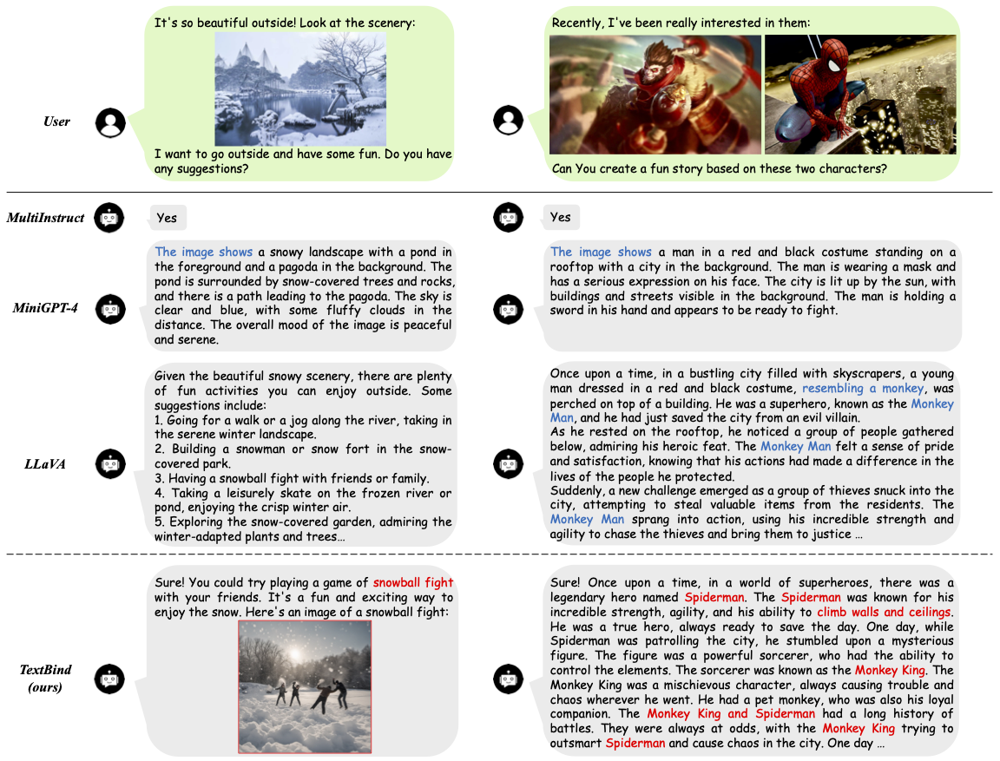

# TextBind: Multi-turn Interleaved Multimodal Instruction-following


<p align="left">
   🌐 <a href="https://textbind.github.io" target="_blank">Project Page</a> • 🤗 <a href="https://ailabnlp.tencent.com/research_demos/textbind/" target="_blank">Online Demo</a> • 📃 <a href="http://arxiv.org/abs/2305.16355" target="_blank">Paper</a> •  ⏬ <a href="https://drive.google.com/drive/folders/1-SkzQRInSfrVyZeB0EZJzpCPXXwHb27W?usp=sharing" target="_blank">Data</a> • 🤖 <a href="https://huggingface.co/SihengLi/TextBind" target="_blank">Model</a>
</p>


****
<span id='content'/>

## Content: 
* <a href='#introduction'>1. Introduction</a>
* <a href='#running_textbind'>2. Build Our Demo Locally</a>
    * <a href='#install_environment'>2.1. Environment Installation</a>
    * <a href='#prepare_blip2_vision_model'>2.2. Prepare BLIP-2 Vsion Model</a>
    * <a href='#prepare_textbind_weights'>2.3. Prepare TextBind Weights</a>
    * <a href='#running_demo'>2.4. Running Demo</a>
* <a href='#train_textbind'>3. Train Your Own Models Using Our TextBind Recipe</a>
    * <a href='#data_preparation'>3.1. Data Preparation</a>
    * <a href='#training_configurations'>3.2. Training Configurations</a>
    * <a href='#training_textbind'>3.3. Training TextBind</a>
* <a href='#license'>Usage and License Notices</a>
* <a href='#citation'>Citation</a>

****

<span id='introduction'/>

### 1. Introduction: <a href='#content'>[Back to Top]</a>

<p align="center" width="100%">

</p>

Large language models with instruction-following abilities have revolutionized the field of artificial intelligence. These models show exceptional generalizability to tackle various real-world tasks through their natural language interfaces. However, their performance heavily relies on high-quality exemplar data, which is often difficult to obtain. This challenge is further exacerbated when it comes to multimodal instruction following. We introduce TextBind, an almost annotation-free framework for empowering larger language models with the multi-turn interleaved multimodal instruction-following capabilities. Our approach requires only image-caption pairs and generates multi-turn multimodal instruction-response conversations from a language model.

****

<span id='running_textbind'/>

### 2. Build Our Demo Locally: <a href='#content'>[Back to Top]</a>

<span id='install_environment'/>

#### 2.1. Install Environment:
Install the Pytorch package with the correct cuda version, for example
```
conda install pytorch torchvision torchaudio pytorch-cuda=11.7 -c pytorch -c nvidia
```

Then install the required environment, please run
```
pip install -r requirements.txt
```

<span id='prepare_blip2_vision_model'/>

#### 2.2. Prepare BLIP-2 Vsion Model and Q-Former:
BLIP-2 vision model and Q-Former is utilized for initialization, run:
```
import torch
from transformers import Blip2ForConditionalGeneration
model = Blip2ForConditionalGeneration.from_pretrained("Salesforce/blip2-flan-t5-xxl")
vision_model = model.vision_model
vision_model.save_pretrained("checkpoint/blip2_vision_model")

state_dict = model.state_dict()
state_dict = {key: value for key, value in state_dict.items() if key.split(".")[0] in ["query_tokens", "qformer"]}
torch.save(state_dict, "checkpoint/blip2_qformer.pt")
```

<span id='prepare_textbind_weights'/>

#### 2.3. Prepare TextBind Weights:

|**Base Language Model**|**Huggingface Weights Address**|**Maximum Sequence Length**|
|:-------------:|:-------------:|:-------------:|
|Llama-2-7b-chat-hf|[SihengLi/TextBind](https://huggingface.co/SihengLi/TextBind)|768|

Then please put the downloaded checkpoints under the [./checkpoint/](./checkpoint/) directory

<span id='running_demo'/>

#### 2.4. Running Demo:
Please set the checkpoints in scripts/run_demo.sh as
```
CHECKPOINT=./checkpoint/second_stage_model.pt
VISION_MODEL=./checkpoint/blip2_vision_model
LANGUAGE_MODEL=meta-llama/Llama-2-7b-chat-hf
PROCESSOR=Salesforce/blip2-flan-t5-xxl
SD_BASE=stabilityai/stable-diffusion-xl-base-1.0
SD_REFINER=stabilityai/stable-diffusion-xl-refiner-1.0
```
Then you can run the demo locally as
```bash
bash scripts/run_demo.sh
```
****

<span id='train_textbind'/>

### 3. Train Your Own Models Using Our TextBind Recipe: <a href='#content'>[Back to Top]</a>

**Prerequisites:** Before training the model, making sure the environment is properly installed and the BLIP-2 vision model and Q-Former have been prepared. You can refer to <a href='#install_environment'>[Here]</a> for more information.  

<span id='data_preparation'/>

#### 3.1. Data Preparation:

**Declaimer:** To ensure the reproducibility of our results, we have released our training dataset. The dataset must be used for research purpose only.

|**Training Stage**|**Dataset Address**|
|:-------------:|:-------------:|
|Multimodal Alignment|[CC3M+CC12M+SBU](https://github.com/Vision-CAIR/MiniGPT-4/blob/main/dataset/README_1_STAGE.md)|
|Multimodal Instruction Following|[TextBind](https://drive.google.com/drive/folders/1-SkzQRInSfrVyZeB0EZJzpCPXXwHb27W?usp=sharing)|

After downloading, put the downloaded file under the [./data/](./data/) directory.

For our textbind, you need to download the images manually using the url_list provided in the downloaded file and rename the download image according to the image_list.

> **** The data directory should look like:

    .
    └── ./data/ 
         └── /cc_sbu/
             └── /cc_sbu_dataset/
                 └── {00000..01254}.tar
         └── /textbind/
             ├── train.json
             └── /images/
                 ├── 490272.png
                 ├── 862235.png
                 └── ...
              

<span id='training_configurations'/>

#### 3.2 Training Configurations:

The table below show the training hyperparameters used in our experiments. The hyperparameters are selected based on the constrain of our computational resources, i.e. 8 x A100 (40G) GPUs.

|**Training Stage**|**Language Model**|**Epoch**|**Batch Size**|**Learning Rate**|**Training Modules**|
|:-------------:|:-------------:|:-------------:|:-------------:|:-------------:|:-------------:|
|Multimodal Alignment|Llama-2-7b-chat-hf|2|256|1e-4|Q-Former, Linear|
|Multimodal Instruction Following|Llama-2-7b-chat-hf|3|64|1e-5|QFormer, Linear, LLM|


<span id='training_textbind'/>


#### 3.3. Training TextBind:
For the multimodal alignment stage, please set the paths in scripts/run_first_stage.sh as
```
TRAIN_DATA_PATH=${your_first_stage_data_path}
CHECKPOINT=./checkpoint/blip2_qformer.pt
VISION_MODEL=./checkpoint/blip2_vision_model
LANGUAGE_MODEL=meta-llama/Llama-2-7b-chat-hf
PROCESSOR=Salesforce/blip2-flan-t5-xxl
```
 
then run the following commands:
```
bash scripts/run_first_stage.sh
```

For the multimodel instruction tuning stage, please set the paths in scripts/run_second_stage.sh as
```
TRAIN_DATA_PATH=${your_second_stage_data_path}
CHECKPOINT=${your_first_stage_model_path}
VISION_MODEL=./checkpoint/blip2_vision_model
LANGUAGE_MODEL=meta-llama/Llama-2-7b-chat-hf
PROCESSOR=Salesforce/blip2-flan-t5-xxl
```

then run the following commands:
```
bash scripts/run_second_stage.sh
```

****

<span id='license'/>

### Usage and License Notices:

TextBind is intended and licensed for research use only. The dataset is CC BY NC 4.0 (allowing only non-commercial use) and models trained using the dataset should not be used outside of research purposes. The delta weights are also CC BY NC 4.0 (allowing only non-commercial use).


****

<span id='citation'/>

### Citation:

If you found TextBind useful in your research or applications, please kindly cite using the following BibTeX:
```
@article{li2023textbind,
  title={TextBind: Multi-turn Interleaved Multimodal Instruction-following},
  author={Li, Huayang and Li, Siheng and Cai, Deng and Wang, Longyue and Liu, Lemao and Watanabe, Taro and Yang, Yujiu and Shi, Shuming},
  year={2023}
}
```
